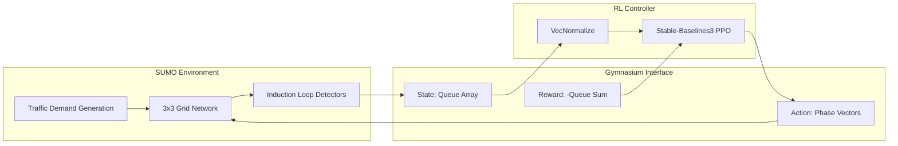

# Traffic Signal Optimization — SUMO + PPO

[](https://opensource.org/licenses/MIT)
[](https://www.python.org/downloads/)
[](https://stable-baselines3.readthedocs.io/)
[](https://eclipse.dev/sumo/)

## Overview
This repository contains a production-quality engineering baseline for **multi-intersection traffic signal optimization** using Deep Reinforcement Learning. It implements a centralized **Proximal Policy Optimization (PPO)** agent controlling a 3x3 urban traffic grid simulated in Eclipse SUMO.

## Motivation
Traffic congestion is a highly dynamic problem that traditional, fixed-time algorithms struggle to optimize under variable loads. Reinforcement Learning offers a data-driven alternative. The goal of this project (Version 1) is to build an airtight, **fully reproducible engineering pipeline** that connects the SUMO microscopic traffic simulator to PyTorch-based RL algorithms, serving as the foundational infrastructure for future Multi-Agent (MARL) research.

## Architecture

The system wraps the SUMO simulator inside a custom, strictly-typed `gymnasium.Env`. A centralized Stable-Baselines3 PPO agent ingests real-time queue lengths and outputs synchronized phase transitions.



## Project Structure
```text
Traffic_signal_optimization/
├── env/                    # Gymnasium environment integration
│   ├── traffic_env.py      # Core SUMO-Gymnasium wrapper
│   └── test_env.py         # Automated environment validation
├── experiments/            # Documentation of hyperparameter configurations
├── networks/               # SUMO XML topology definitions
├── results/                # Output artifacts
│   ├── benchmarks/         # Generated CSVs and JSONs
│   ├── models/             # Saved PyTorch models and VecNormalize stats
│   ├── plots/              # Matplotlib visualizations
│   └── tensorboard/        # PPO training telemetry
├── training/               # RL training and evaluation suite
│   ├── evaluate_baselines.py
│   ├── metrics.py
│   ├── plot_metrics.py
│   ├── train_ppo.py
│   ├── verify_behavior.py
│   └── verify_reproducibility.py
├── run_post_training.bat   # Automated evaluation executor
└── VERSION1_REPORT.md      # Detailed engineering report
```

## Installation

Ensure you have [Eclipse SUMO](https://eclipse.dev/sumo/) installed and `SUMO_HOME` mapped in your system environment variables.

```bash
# Clone the repository
git clone https://github.com/yourusername/traffic-signal-optimization.git
cd traffic-signal-optimization

# Install requirements
pip install -r requirements.txt
```

## Usage

### 1. Environment Validation
Verify that the `traffic_env.py` wrapper integrates safely with your SUMO installation:
```bash
python -m env.test_env
```

### 2. Training (Centralized PPO)
Train the PPO agent for 200,000 timesteps using the high-speed `libsumo` backend. Models are checkpointed every 20,000 steps.
```bash
python training/train_ppo.py
```

### 3. TensorBoard Telemetry
Monitor the PPO value function, entropy loss, and raw rewards:
```bash
tensorboard --logdir results/tensorboard/
```

### 4. Automated Benchmarking
Run the deterministic multi-policy benchmark suite. This evaluates PPO against a Fixed-Time baseline (30s cycles) and a Uniform Random controller:
```bash
python training/evaluate_baselines.py
```

*Alternatively, execute `run_post_training.bat` (Windows) to run all benchmarking, behavioral verification, and plotting simultaneously.*

## Evaluation & Results

The system evaluates policies over 5 fixed-seed simulation rollouts to guarantee deterministic parity. At 200,000 steps, a centralized PPO agent controlling a $2^5$ joint-action space requires extreme data efficiency to outperform static rules.

*(See `VERSION1_REPORT.md` for the complete analytical breakdown of the baseline metrics).*

## Known Limitations

- **Action Coupling**: Controlling 5 intersections with a single shared MLP creates a severe bottleneck. The agent must infer spatial dependencies without an explicit attention mechanism.
- **Credit Assignment**: A phase transition at step $t$ might not relieve queue lengths until step $t+50$. This temporal delay hinders PPO's value function convergence.
- **Phase Encodings**: Current phases are encoded continuously, introducing a false ordinal relationship into the neural network.

## Roadmap (Version 2)

Version 2 will deprecate the centralized MLP in favor of scalable, graph-aware architectures:
- **Multi-Agent Reinforcement Learning (MARL)**: Decentralizing the policy to independent intersection agents.
- **Graph Neural Networks (GNNs)**: Implementing Graph Convolutional layers to process adjacent node states spatially.
- **Shared Policies with Neighbor Communication**: Allowing localized agents to share network weights while communicating hidden states across induction edges.
