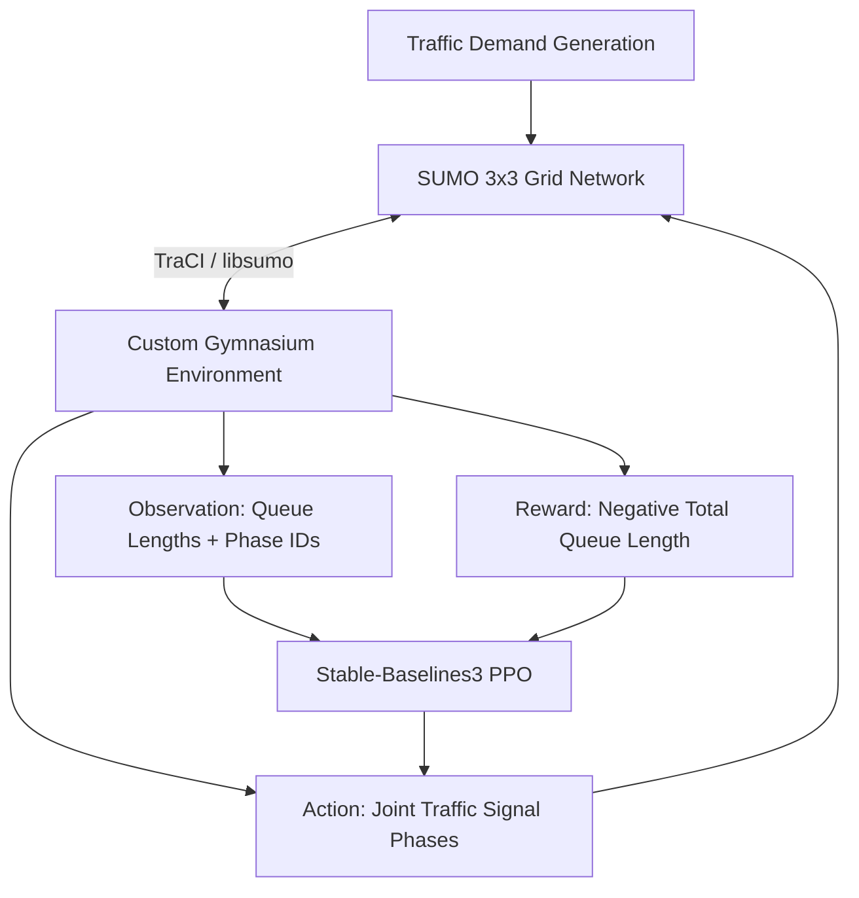

# Traffic Signal Optimization — SUMO + PPO

[](https://opensource.org/licenses/MIT)
[](https://www.python.org/downloads/)
[](https://stable-baselines3.readthedocs.io/)
[](https://eclipse.dev/sumo/)

## Overview

This repository implements a **centralized Proximal Policy Optimization (PPO) baseline** for multi-intersection traffic signal control. A single PPO agent simultaneously controls 5 signalized intersections in a 3×3 urban grid simulated with [Eclipse SUMO](https://eclipse.dev/sumo/), with the objective of minimizing network-wide vehicle queue lengths.

This is **Version 1** of the project. It establishes a fully reproducible simulation-to-learning pipeline, a deterministic benchmarking suite, and a comparison against Fixed-Time and Random heuristic baselines.

> See [`VERSION1_REPORT.md`](VERSION1_REPORT.md) for the full technical engineering report.

---

## Key Features

- **SUMO microscopic simulation** — Eclipse SUMO 1.27.0 with realistic stochastic vehicle demand
- **Custom Gymnasium environment** — Strictly-typed `gymnasium.Env` wrapper with automatic yellow-phase safety transitions
- **Centralized PPO** — Stable-Baselines3 PPO with shared MLP policy controlling all 5 intersections jointly
- **Queue-length observations** — 25-dimensional state vector (4 directional queues + phase ID per intersection)
- **MultiDiscrete joint action space** — `MultiDiscrete([2, 2, 2, 2, 2])` yielding 32 possible joint phase combinations
- **libsumo acceleration** — C++ libsumo backend bypasses TCP socket overhead for 10–50× training speedup
- **Deterministic evaluation** — 5 fixed seeds (`42, 100, 256, 1024, 2026`) guarantee reproducible benchmark comparisons
- **TensorBoard telemetry** — Training reward curves, value loss, policy entropy, and explained variance

---

## Architecture



---

## Project Structure

```text
traffic-signal-optimization-rl/
├── env/
│   ├── traffic_env.py          # Core SUMO-Gymnasium wrapper (TrafficEnv)
│   └── test_env.py             # Automated environment validation suite
├── networks/
│   ├── grid.net.xml            # SUMO 3x3 grid network topology
│   ├── routes.rou.xml          # Stochastic vehicle demand routes
│   └── additional.add.xml      # Induction loop detector definitions
├── training/
│   ├── train_ppo.py            # PPO training with VecNormalize + checkpointing
│   ├── evaluate_baselines.py   # Multi-policy deterministic benchmark suite
│   ├── metrics.py              # Episode metrics tracking and CSV/JSON export
│   ├── plot_metrics.py         # Comparative Matplotlib bar charts
│   ├── verify_behavior.py      # Deadlock detection via wait-time auditing
│   └── verify_reproducibility.py  # Seed determinism assertion suite
├── results/
│   ├── benchmarks/             # phase4_episodes.csv, phase4_summary.json
│   ├── models/                 # PPO .zip checkpoints and VecNormalize .pkl
│   ├── plots/                  # Generated comparison charts
│   └── tensorboard/            # PPO training event logs
├── experiments/                # Hyperparameter configuration notes
├── requirements.txt
├── run_post_training.bat       # Windows: benchmark + verify + plot in sequence
└── VERSION1_REPORT.md          # Full V1 technical engineering report
```

---

## Installation

Ensure [Eclipse SUMO](https://eclipse.dev/sumo/) is installed and `SUMO_HOME` is set in your system environment variables.

```bash
# Clone the repository
git clone https://github.com/yourusername/traffic-signal-optimization-rl.git
cd traffic-signal-optimization-rl

# Install Python dependencies
pip install -r requirements.txt
```

---

## Usage

### 1. Environment Validation

Verify that the Gymnasium wrapper integrates correctly with your SUMO installation:

```bash
python -m env.test_env
```

### 2. PPO Training

Train the centralized PPO agent for 200,000 timesteps using the libsumo backend. Models are checkpointed every 20,000 steps under `results/models/`.

```bash
python training/train_ppo.py
```

### 3. TensorBoard Monitoring

Monitor training reward, value loss, and policy entropy in real time:

```bash
tensorboard --logdir results/tensorboard/
```

### 4. Deterministic Benchmarking

Evaluate PPO against Fixed-Time (30 s cycle) and Uniform Random baselines across 5 fixed seeds:

```bash
python training/evaluate_baselines.py
```

On Windows, run all post-training steps in sequence:

```bat
run_post_training.bat
```

---

## Evaluation & Results

Policies are evaluated over **5 deterministic episodes** (500 steps / 2,500 simulation seconds each).

| Metric | PPO Agent (200k steps) | Fixed-Time (30 s) | Random |
|:---|---:|---:|---:|
| **Avg Queue / Step** (vehicles) | 343.74 | 146.15 | 155.81 |
| **Queue Variance** | 4,366 | 563 | 1,766 |
| **Avg Waiting Time / Episode** (s) | 49,047 | 1,542 | 1,714 |
| **Mean Throughput** (vehicles) | 9,607 | 10,658 | 12,969 |
| **Signal Switches** | 353 | 415 | 1,240 |
| **Mean Episode Reward** | −171,872 | −73,074 | −77,906 |

> **Interpretation:** At 200,000 training steps, the centralized PPO agent has not yet surpassed the Fixed-Time heuristic. This is an expected consequence of the centralized architecture's credit assignment and action-coupling challenges at this training horizon. See [`VERSION1_REPORT.md`](VERSION1_REPORT.md) for a full analysis.

---

## Known Limitations

- **Action coupling** — A single MLP must infer spatial dependencies across 5 intersections without an explicit attention or graph mechanism.
- **Credit assignment** — A poor phase decision at step *t* may not raise queue penalties until step *t + 30*, delaying value function learning.
- **Categorical phase encoding** — Phase IDs (0–3) are passed as raw floats, introducing a false ordinal relationship the network must compensate for.
- **Observation boundary** — Congestion at the 4 uncontrolled boundary intersections is not visible in the agent's observation.
- **Scalability** — The joint action space grows as 2^N, making this architecture impractical beyond small grids.

---

## Roadmap — Version 2

Version 2 is under active local development and is **not yet committed to this repository**. Planned extensions include:

- **Multi-Agent Reinforcement Learning (MARL)** — Decentralized per-intersection agents, reducing per-agent action space from 32 to 2
- **Graph Neural Networks (GNNs)** — Graph Convolutional layers to process spatial intersection relationships natively
- **Shared Decentralized Policy** — A single weight set executed independently at each node
- **Neighbor Communication** — Augmenting local observations with encoded hidden states from adjacent intersections
- **Graph-Based State Representation** — Replacing the flat 25-feature vector with structured node and edge attributes

---

## License

[MIT](LICENSE) © 2026
