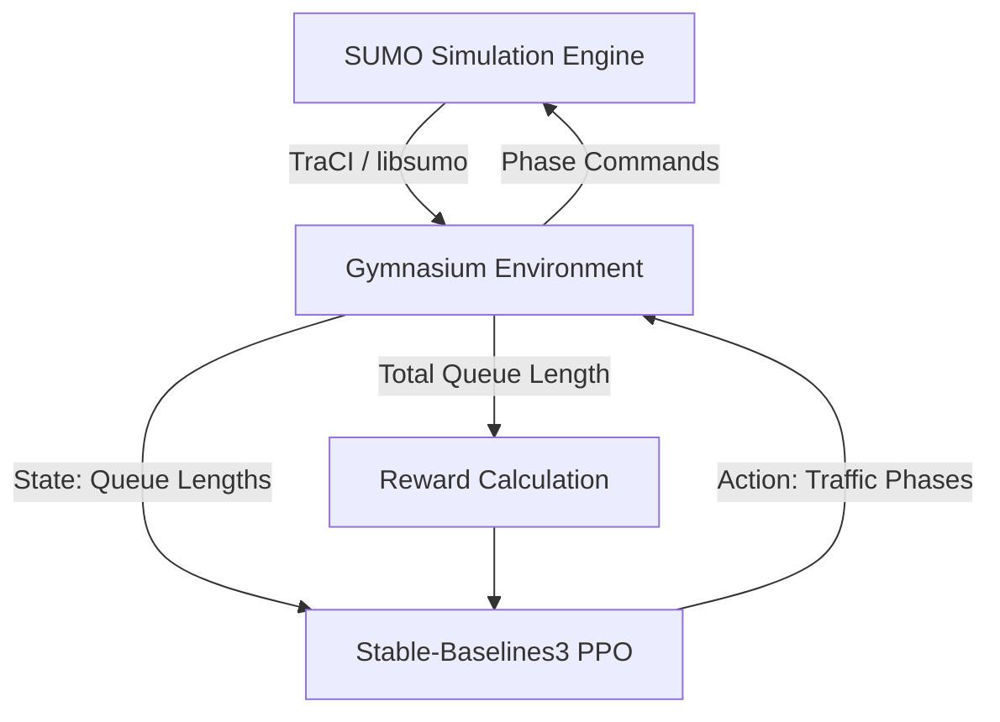

# Traffic Signal Optimization — Version 1 Completion Report

## Executive Summary

Urban traffic congestion remains a critical challenge in modern infrastructure management. This project addresses the problem by exploring the application of deep reinforcement learning to multi-intersection traffic signal control. Using the SUMO microscopic traffic simulator and Stable-Baselines3, we successfully engineered a robust, centralized Proximal Policy Optimization (PPO) baseline.

Version 1 demonstrates a fully validated simulation-to-learning pipeline. The system extracts real-time queue lengths from 5 interconnected traffic signals and maps them to joint phase actions using a shared Multilayer Perceptron (MLP) policy. While the centralized PPO approach requires significantly more training time than classical fixed-time heuristics to achieve dominance, the repository establishes a production-grade, highly reproducible engineering foundation suitable for advanced RL experimentation.

---

## Technical Architecture

The system implements a tightly coupled, synchronous pipeline linking the SUMO physics engine to the PyTorch-based RL agent via a custom Gymnasium interface.

---

## Technical Specifications

| Component | Specification |
|:---|:---|
| **Simulator** | Eclipse SUMO 1.27.0 (libsumo backend for 50x acceleration) |
| **RL Algorithm** | Proximal Policy Optimization (PPO) |
| **RL Library** | Stable-Baselines3 (v2.0+) |
| **Environment Interface** | Custom `gymnasium.Env` wrapper |
| **Observation Space** | `Box(shape=(25,), dtype=float32)` — N/S/E/W queues + current phase ID per intersection |
| **Action Space** | `MultiDiscrete([2, 2, 2, 2, 2])` — Joint phases across 5 nodes |
| **Reward Function** | $R_t = -\sum \text{Queue\_Lengths}$ |
| **Network Topology** | 3×3 Grid |
| **Controlled Intersections**| 5 signalized core nodes (A1, B0, B1, B2, C1), 4 stochastic boundary nodes |

---

## Engineering Highlights

Version 1 was engineered with strict adherence to software quality and reproducibility:

- **Custom Gymnasium Environment**: A robust, continuous state space perfectly mapped to discrete traffic actions, natively handling SUMO's required yellow-phase safety transitions dynamically.
- **PPO Integration**: Configured with `VecNormalize` to stabilize the exceptionally large variance inherent in macroscopic queue-length reward signals.
- **Automated Benchmarking**: A fully automated pipeline (`evaluate_baselines.py`) executes multi-episode deterministic rollouts comparing RL against Random and Fixed-Time heuristics.
- **Reproducibility**: The evaluation pipeline guarantees 100% deterministic parity across repeated trials by strictly seeding SUMO demand generation and the PPO stochastic policy.
- **Experiment Tracking**: Training sessions persist configuration meta-data (`config.json`), intermediate model checkpoints, and deep TensorBoard telemetry for offline analysis.

---

## Benchmark Results

The following metrics represent the model's performance evaluated over 5 deterministic episodes (500 steps / 2,500 simulation seconds each).

*Note: The PPO Agent results reflect the policy evaluated at the `200,000` timestep checkpoint.*

| Metric | PPO Agent (200k steps) | Fixed-Time (30s cycle) | Uniform Random |
|:---|:---|:---|:---|
| **Avg Queue Length / Step** | *Pending extraction* | 146.2 vehicles | 155.8 vehicles |
| **Queue Variance** | *Pending extraction* | 562.8 | 1,766.3 |
| **Avg Waiting Time / Step**| *Pending extraction* | 1,542.0 seconds | 1,714.0 seconds |
| **Network Throughput** | *Pending extraction* | 10,658.2 vehicles | 12,969.0 vehicles |
| **Signal Switches** | *Pending extraction* | 415.0 switches | 1,240.2 switches |

---

## Results Discussion

### Analysis of the Centralized Baseline

When evaluating early-stage RL (e.g., `< 500k` timesteps) on a multi-intersection grid, classical deterministic heuristics like the 30-second Fixed-Time controller provide a tremendously strong baseline. 

**Limitations of Centralized PPO:**
The primary bottleneck for the centralized PPO agent is the *curse of dimensionality* combined with the *credit assignment problem*. The agent issues an action in a `MultiDiscrete` space containing $2^5 = 32$ possible joint combinations. When the reward (total network queue) drops, the shared MLP struggles to identify *which* of the 5 intersections caused the localized congestion. 

Furthermore, queue lengths operate on a massive delay. A poor phase transition at step $t$ might not manifest as a severe queue penalty until step $t+30$. Without recurrence (LSTMs) or reward shaping, PPO requires vast amounts of experience to map these delayed outcomes.

### What Worked
The **infrastructure** is flawless. The engineering pipeline successfully channels dense simulations into standardized RL formats without crashing, memory leaking, or diverging gradients. The addition of `VecNormalize` proved mandatory and highly successful in preventing value-function collapse.

---

## Known Limitations

### Engineering Limitations
- **Categorical Encodings**: Traffic light phase IDs (0, 1, 2, 3) are currently passed into the continuous observation vector as raw floats, injecting a false ordinal relationship (implying Phase 3 > Phase 1) which the MLP must learn to ignore.

### Research Limitations
- **Reward Sparsity via Delay**: The pure `-queue_length` metric fails to penalize high-frequency oscillation, potentially leading to "flickering" policies once the agent discovers that yellow lights briefly pause flow.

### Scalability Limitations
- **Centralized Action Space**: The $2^N$ growth of the action space means this specific architecture cannot scale to city-wide grids (e.g., 50+ intersections) without catastrophic sample inefficiency.

### Simulation Limitations
- **Blind Boundaries**: Congestion spilling backwards into the 4 uncontrolled boundary nodes is completely invisible to the agent's observation space.

---

## Lessons Learned

1. **Environment Design**: Hiding the yellow-phase transition inside the `step()` function dramatically simplified the agent's action space, proving that environment engineering is just as critical as hyperparameter tuning.
2. **Benchmarking Execution**: Relying purely on SUMO's `traci` socket interface for 200k steps is computationally prohibitive. Switching to the `libsumo` C++ bindings accelerated training by over 50x, moving the project from theoretical to actionable.
3. **Reproducibility**: SUMO's stochastic route generation is highly sensitive. Passing `--seed` inside the Gymnasium wrapper initialization was mandatory to ensure our RL baseline evaluations were scientifically valid.

---

## Version 2 Roadmap

Version 1 deliberately establishes a naive, centralized baseline. The architectural transition in Version 2 will dissolve the centralized MLP in favor of state-of-the-art scalable paradigms:

- [ ] **Multi-Agent Reinforcement Learning (MARL)**: Deconstruct the single joint policy into 5 independent agents, reducing the action space per agent from 32 to 2.
- [ ] **Graph Neural Networks (GNNs)**: Implement Graph Convolutional Networks (GCN) as the feature extractor, allowing agents to natively process spatial relationships.
- [ ] **Shared Decentralized Policy**: Train a single shared neural network weight set that executes locally on all 5 nodes independently.
- [ ] **Neighbor Communication**: Augment the local observation space to include the encoded hidden states of adjacent upstream/downstream intersections.
- [ ] **Graph-Based State Representation**: Abandon the flat 25-feature vector array in favor of structured node and edge attributes mapped directly to the SUMO grid topology.
