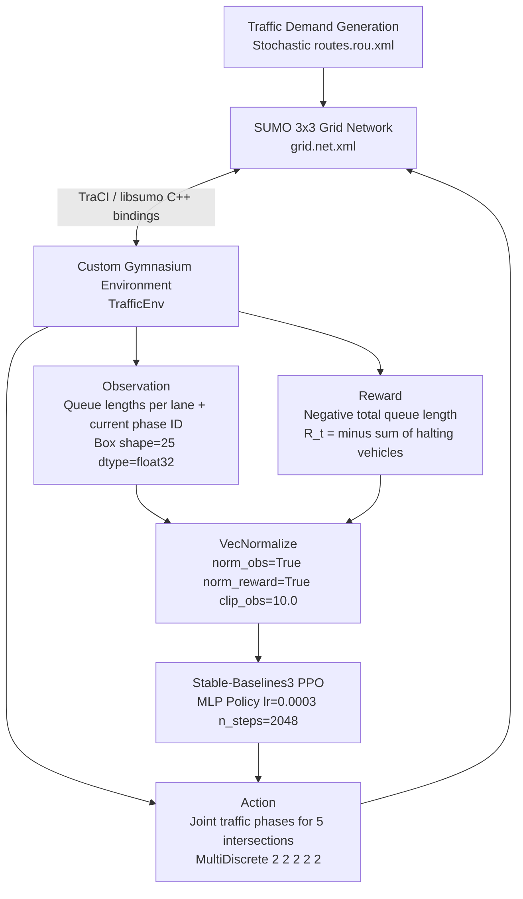

# Traffic Signal Optimization — Version 1 Completion Report

---

## 1. Executive Summary

Version 1 of the Traffic Signal Optimization project delivers a fully operational, reproducible reinforcement learning pipeline for multi-intersection traffic signal control. The system integrates the Eclipse SUMO microscopic traffic simulator with a custom `gymnasium.Env` wrapper and a centralized Proximal Policy Optimization (PPO) agent implemented via Stable-Baselines3.

The V1 pipeline successfully demonstrates:
- Stable end-to-end training with no gradient divergence or simulation crashes
- Deterministic multi-policy benchmarking across 5 fixed seeds
- A clear performance baseline for comparison in future work

At the 200,000-timestep mark, the centralized PPO agent has not surpassed the Fixed-Time heuristic baseline. This result is consistent with the known challenges of centralized multi-intersection control and serves as the motivating case for the V2 architectural redesign.

---

## 2. Problem Definition

Urban traffic signal control is a sequential decision-making problem where the objective is to minimize network-wide congestion by dynamically adjusting signal phases at each intersection. Traditional Fixed-Time controllers operate on pre-programmed cycle lengths that do not respond to real-time demand fluctuations.

Reinforcement Learning is a natural fit for this problem because:
- Traffic demand is stochastic and time-varying
- Optimal signal timing depends on upstream and downstream queue states
- The environment provides dense, step-level reward signals (queue lengths)
- Standard simulation tooling (SUMO) enables safe, low-cost policy exploration

However, RL for traffic control is not straightforward. Multi-intersection control introduces spatial coupling between adjacent nodes, significant temporal delays between actions and their queue effects, and exponentially growing joint action spaces.

Version 1 targets these challenges by first establishing a reproducible centralized PPO baseline — a necessary reference point before exploring decentralized or graph-based architectures.

---

## 3. Version 1 Objectives

Version 1 was scoped to accomplish the following engineering and research goals:

1. **SUMO integration** — Connect the Eclipse SUMO simulator to Python via TraCI/libsumo in a stable, crash-free manner.
2. **Custom Gymnasium environment** — Implement a strictly-typed `gymnasium.Env` wrapper that correctly exposes observations, actions, and rewards.
3. **Centralized PPO baseline** — Train a single Stable-Baselines3 PPO agent on the joint multi-intersection action space.
4. **Reproducible training and evaluation** — Guarantee deterministic rollouts using fixed seeds and VecNormalize for stable gradient estimates.
5. **Baseline comparison** — Benchmark the PPO agent against a Fixed-Time heuristic and a Uniform Random controller under identical simulation conditions.

V1 does **not** aim to achieve state-of-the-art traffic performance; it aims to establish a reliable engineering foundation.

---

## 4. Technical Architecture

The V1 system implements a synchronous, tightly coupled pipeline from SUMO simulation to PPO policy update.



---

## 5. Technical Specifications

| Component | Specification |
|:---|:---|
| **Simulator** | Eclipse SUMO 1.27.0 |
| **Simulation Backend** | libsumo (C++ bindings, ~10–50× faster than TraCI TCP) |
| **RL Algorithm** | Proximal Policy Optimization (PPO) |
| **RL Library** | Stable-Baselines3 v2.0+ |
| **Neural Network** | MLP Policy (shared actor-critic) |
| **Environment Interface** | Custom `gymnasium.Env` wrapper |
| **Observation Space** | `Box(shape=(25,), dtype=float32)` — N/S/E/W queue lengths + current phase ID for 5 intersections |
| **Action Space** | `MultiDiscrete([2, 2, 2, 2, 2])` — joint binary phase selection across 5 intersections; 2^5 = 32 joint combinations |
| **Reward Function** | R_t = −(sum of halting vehicles across all controlled lanes) |
| **Network Topology** | 3×3 grid — 9 total intersections |
| **Controlled Intersections** | 5 interior nodes (A1, B0, B1, B2, C1) |
| **Uncontrolled Nodes** | 4 boundary intersections with stochastic behavior |
| **Episode Length** | 500 steps (2,500 simulation seconds) |
| **Training Timesteps** | 200,000 |
| **Checkpoint Interval** | Every 20,000 steps |
| **PPO Learning Rate** | 0.0003 |
| **PPO n_steps** | 2,048 |
| **Evaluation Seeds** | 42, 100, 256, 1024, 2026 |

---

## 6. Environment Design

### Observation Construction

At each step, the environment queries SUMO via TraCI for the number of halting vehicles on each incoming lane of each controlled intersection. The raw observation vector has shape `(25,)`:

- For each of the 5 controlled intersections: 4 directional queue counts (N, S, E, W) + 1 current phase ID
- Phase IDs are passed as raw float values (0.0, 1.0, 2.0, 3.0)

### Action Representation

The action space is `MultiDiscrete([2, 2, 2, 2, 2])`, where each element selects one of two green-phase options for one intersection:
- **Action 0**: N/S Green phase
- **Action 1**: E/W Green phase

Phase semantics are kept consistent across all 5 nodes by standardizing the phase order in `grid.net.xml` during network setup.

### Reward Calculation

The reward at each step is the negative sum of halting vehicles across all incoming lanes of all 5 controlled intersections:

```
R_t = −(sum of halting vehicles on all monitored lanes)
```

This penalizes queue build-up directly and provides a dense, step-level signal. The sign convention ensures that the agent maximizes reward by minimizing queues.

### Yellow-Phase Handling

Direct transitions between conflicting green phases require a safety interlock. The `step()` function automatically inserts a 3-second yellow phase whenever the requested action differs from the current active phase. This keeps the RL action space clean (binary per intersection) while enforcing physical signal safety constraints.

### Simulation Stepping

Each `step()` call advances the SUMO simulation by one signal control cycle. The environment tracks a step counter (`current_step`) and returns `truncated=True` at `max_steps=500`, preventing infinite gridlock episodes during training.

---

## 7. PPO Training Design

### Centralized Architecture

A single PPO agent with a shared MLP policy receives the full 25-dimensional observation and outputs a `MultiDiscrete` joint action for all 5 intersections simultaneously. This is the simplest possible architecture: no communication, no decentralization, no spatial structure.

### VecNormalize

Raw episode rewards range from approximately −60,000 to −180,000 across policies, producing gradient magnitudes that cause early value-function collapse. `VecNormalize(norm_obs=True, norm_reward=True, clip_obs=10.0)` is applied to the `DummyVecEnv` wrapper to standardize both observations and rewards before they reach the PPO optimizer.

### libsumo Acceleration

The training environment sets `LIBSUMO_AS_TRACI=1`, switching from TraCI's TCP socket interface to the C++ libsumo library. This eliminates socket serialization overhead and reduces per-step simulation time by 10–50×, making 200,000-step training feasible within hours rather than days.

### Checkpointing

Models are saved every 20,000 timesteps as `.zip` files under `results/models/`. The final VecNormalize running statistics are saved as a `.pkl` file alongside the model, which is required to correctly normalize observations during evaluation.

### TensorBoard Telemetry

The `Monitor` wrapper streams per-episode rewards, episode lengths, and training metrics to `results/tensorboard/`. Tracked quantities include: reward curves, value function loss, policy entropy, explained variance, and clip fraction.

---

## 8. Evaluation Methodology

### Deterministic Seeding

Each policy is evaluated across 5 fixed seeds: `42, 100, 256, 1024, 2026`. Seeds are passed to both the SUMO demand generator (route departure timing) and the stochastic policy sampler. This ensures that all three policies (PPO, Fixed-Time, Random) experience identical vehicle insertion sequences, making their metrics directly comparable.

### Episode Configuration

Each evaluation episode runs for 500 steps (2,500 simulation seconds). Metrics are collected per step and aggregated per episode.

### Metrics Collected

Per episode: total reward, average queue length per step, queue variance, average waiting time, network throughput, and signal switch count. Per-intersection queue breakdowns are also recorded.

### Baselines

- **Fixed-Time (30 s cycle)**: Alternates N/S and E/W green phases on a fixed 30-second schedule. No observation of queue state.
- **Uniform Random**: Selects a random joint action from `MultiDiscrete([2,2,2,2,2])` at each step, independent of queue state.

---

## 9. Benchmark Results

All results are from `results/benchmarks/phase4_summary.json`, evaluated at the 200,000-timestep checkpoint over 5 deterministic episodes.

| Metric | PPO Agent (200k steps) | Fixed-Time (30 s) | Random |
|:---|---:|---:|---:|
| **Avg Queue / Step** (vehicles) | 343.74 ± 9.22 | 146.15 ± 1.23 | 155.81 ± 5.49 |
| **Queue Variance** | 4,366 | 563 | 1,766 |
| **Avg Waiting Time / Episode** (s) | 49,047 ± 5,530 | 1,542 ± 24 | 1,714 ± 173 |
| **Mean Throughput** (vehicles) | 9,607 ± 218 | 10,658 ± 28 | 12,969 ± 93 |
| **Signal Switches** | 353 ± 24 | 415 | 1,240 ± 33 |
| **Mean Episode Reward** | −171,872 ± 4,609 | −73,074 ± 613 | −77,906 ± 2,746 |

The per-episode breakdown is available in `results/benchmarks/phase4_episodes.csv`.

---

## 10. Results Discussion

### Performance Outcome

At 200,000 training timesteps, the centralized PPO agent performs substantially worse than both the Fixed-Time and Random heuristics on every measured metric. This result, while unfavorable for the RL policy, is analytically expected and provides important information for V2 design.

### Action Coupling

The centralized MLP must learn to coordinate all 5 intersections simultaneously from a single forward pass. When the global queue reward drops, the network cannot determine which of the 32 joint action combinations caused the improvement, or which of the 5 intersections was responsible. This credit assignment problem grows with the number of controlled nodes.

### Temporal Credit Assignment

Queue lengths respond to phase transitions with a delay. A poorly timed green phase at intersection B1 may not increase queue penalties until 20–50 simulation steps later, when upstream vehicles have propagated forward. Without recurrence (e.g., LSTM) or explicit reward shaping, PPO's bootstrapped value estimates struggle to capture these delayed effects.

### High Queue Variance

The PPO policy produces a queue variance of 4,366 compared to 563 for Fixed-Time. This indicates that the PPO policy introduces more instability into the network than a simple fixed cycle, suggesting the agent is not yet discovering beneficial switching patterns.

### Infrastructure Validation

Despite the below-baseline policy performance, the engineering pipeline is fully functional:
- The simulation runs 200,000 steps without crashes or memory leaks
- VecNormalize prevents gradient explosion
- Deterministic seeding yields reproducible per-seed results
- The benchmark suite correctly distinguishes across all three controllers

---

## 11. Known Limitations

### Engineering Limitations

- **Categorical phase encoding**: Phase IDs (0, 1, 2, 3) are passed as raw float values in the continuous observation vector. This implies a false ordinal relationship (Phase 3 > Phase 1) that the MLP must learn to ignore. One-hot encoding or learned embeddings would be more appropriate.
- **Single environment**: Training uses a single `DummyVecEnv` instance, which limits sample diversity within each PPO rollout.

### Research Limitations

- **Reward design**: The pure `−queue_length` metric does not penalize high-frequency phase oscillation. Once an agent discovers that yellow transitions briefly freeze vehicle counting, it may learn a "flickering" policy.
- **No temporal context**: The MLP policy operates on a single-step observation snapshot with no memory of recent queue history.
- **Short training horizon**: At 200,000 timesteps with a 5-intersection joint space, the agent has insufficient experience to reliably converge.

### Scalability Limitations

- **Exponential action space**: The `MultiDiscrete([2,2,2,2,2])` space has 2^5 = 32 joint combinations. Scaling to N intersections yields 2^N combinations, making centralized PPO impractical for grids larger than approximately 8–10 controlled nodes.
- **Shared MLP bottleneck**: A single MLP with no spatial inductive bias cannot generalize learned intersection policies to unseen grid configurations.

### Simulation Limitations

- **Boundary blindness**: The 4 uncontrolled boundary intersections are not included in the observation vector. Congestion propagating from boundary nodes into the controlled core is invisible to the agent.
- **Simplified demand model**: Route demand is generated stochastically but does not model real-world origin-destination patterns, peak hours, or incident events.

---

## 12. Lessons Learned

1. **Yellow-phase abstraction** — Hiding the yellow-phase transition inside `step()` rather than exposing it as an explicit action substantially simplifies the learning problem. The agent operates on clean binary phase decisions without needing to learn safety constraints.

2. **VecNormalize is not optional** — Raw queue-length rewards in the range −60,000 to −180,000 per episode cause immediate value-function collapse without normalization. Adding `VecNormalize` was the single highest-leverage change for training stability.

3. **libsumo is essential for iteration speed** — Running 200,000 training steps over a TCP TraCI socket would take days on commodity hardware. Switching to the C++ libsumo bindings reduced training time from days to hours, enabling practical experimentation.

4. **Seed discipline enables scientific comparison** — SUMO's stochastic demand generator is highly sensitive. Strictly passing seed values to both SUMO and the RL policy was required to ensure that baseline comparisons reflect policy differences rather than simulation variance.

5. **Infrastructure before performance** — Building a reliable, well-tested environment (step truncation, type checking, yellow-phase safety, deterministic evaluation) is a prerequisite for meaningful RL results. Attempting performance optimization on a poorly validated environment produces confounded results.

---

## 13. Future Work — Version 2

> **Note:** The items listed below represent planned future work. They are **not implemented** in the current repository.

Version 1 deliberately establishes a naive centralized baseline to motivate the V2 architectural transition. Version 2 will address the fundamental limitations of centralized control:

- **[ ] Multi-Agent Reinforcement Learning (MARL)** — Decompose the single joint policy into 5 independent per-intersection agents. Each agent observes only its local intersection state, reducing the per-agent action space from 32 to 2 and solving the credit assignment problem.

- **[ ] Graph Neural Networks (GNNs)** — Replace the flat MLP with a Graph Convolutional Network that operates on the traffic grid as a graph, where nodes are intersections and edges encode road connectivity. This provides a spatial inductive bias suited to the problem structure.

- **[ ] Shared Decentralized Policy** — Train a single shared neural network weight set that is executed independently and locally at each intersection. This reduces parameter count while enabling generalization across differently sized grids.

- **[ ] Neighbor Communication** — Augment each agent's local observation with encoded hidden state information from directly adjacent upstream and downstream intersections, enabling limited coordination without centralized control.

- **[ ] Graph-Based State Representation** — Replace the flat 25-dimensional vector with structured node and edge attributes that directly encode the SUMO topology, enabling the GNN to exploit the graph geometry of the traffic network.

