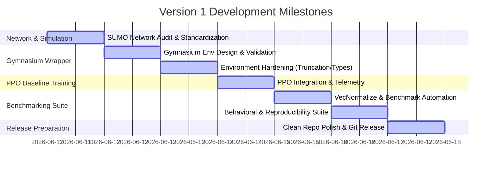

# Version 1 Development Report: Centralized PPO Baseline Analysis & Reverse-Engineering

This report is an internal engineering analysis document for the **Traffic Signal Optimization** project. It reverse-engineers the completed and validated Version 1 baseline repository to reconstruct a professional, git-driven development history, establish repository hygiene, outline branching workflows, and define release milestones.

---

## SECTION 1: Project Development Timeline

Based on the audit of the codebase, Version 1 is organized into seven distinct engineering milestones. These milestones capture the progression from raw simulation configurations to a fully validated, reproducible reinforcement learning baseline.



### Milestone 1: SUMO Network Audit and Standardization
*   **Goal**: Establish a mathematically sound and syntactically valid traffic simulation network.
*   **Key Focus**: Fix XML routing bugs and align intersection phase semantics so that control actions represent identical physical directions across all traffic signals.

### Milestone 2: Custom Gymnasium Environment Integration and Validation
*   **Goal**: Build the core interface bridging the SUMO simulation steps with Python's RL ecosystem.
*   **Key Focus**: Wrap TraCI traffic controls in a custom Gymnasium class, defining standard observation spaces (queues + current phase) and action spaces (discrete traffic light phase selections).

### Milestone 3: Gymnasium Environment Hardening
*   **Goal**: Ensure strict compliance with the modern Gymnasium API to prepare the environment for Stable-Baselines3 (SB3) vectors.
*   **Key Focus**: Implement step counters, truncation flags (`max_steps`), and audit edge-to-intersection mappings to verify zero queue double-counting.

### Milestone 4: Baseline PPO Integration and Instrumentation
*   **Goal**: Connect the hardened environment to the SB3 PPO algorithm and establish tracking telemetry.
*   **Key Focus**: Instrument training with `DummyVecEnv` and `Monitor` wrappers to stream episode rewards to TensorBoard, running a 10,000-timestep validation run to verify training safety.

### Milestone 5: VecNormalize Stabilization and Benchmarking Automation
*   **Goal**: Address training divergence caused by raw reward variance, optimize rollout speed, and construct the evaluation suite.
*   **Key Focus**: Wrap the env with `VecNormalize`, enable the C++ `libsumo` backend to accelerate simulation by bypassing TCP sockets, and build an evaluation script running PPO, Fixed-Time, and Random agents across identical deterministic seeds.

### Milestone 6: Post-Training Verification and Visualization Suite
*   **Goal**: Create tools to audit policy behavior, test reproducibility, and plot performance.
*   **Key Focus**: Write scripts to check for traffic deadlocks (wait times exceeding 500s), assert exact reward/action parity on repeated runs under seed 100, and generate comparative bar charts.

### Milestone 7: Production Release Preparation and Repository Hygiene
*   **Goal**: Refine the repository for open-source distribution and professional review.
*   **Key Focus**: Enforce strict Python typing, document codebases in markdown reports, create `.gitignore` rules, add MIT licensing, and pin requirements.

---

## SECTION 2: Milestone Details

This section details the technical changes, file dependencies, and engineering rationales for each milestone.

### Milestone 1: SUMO Network Audit and Standardization
*   **Purpose**: Resolve simulation load crashes and establish consistent action meanings across intersections.
*   **Files Involved**:
    *   [grid.net.xml](file:///C:/Users/Palav/OneDrive/Desktop/Traffic_signal_optimization/networks/grid.net.xml)
    *   [routes.rou.xml](file:///C:/Users/Palav/OneDrive/Desktop/Traffic_signal_optimization/networks/routes.rou.xml)
    *   [additional.add.xml](file:///C:/Users/Palav/OneDrive/Desktop/Traffic_signal_optimization/networks/additional.add.xml)
*   **Folders Involved**: `networks/`
*   **What Changed**:
    *   Replaced the illegal triple-hyphen (`---`) with double-equals (`===`) inside comments in [routes.rou.xml](file:///C:/Users/Palav/OneDrive/Desktop/Traffic_signal_optimization/networks/routes.rou.xml) to satisfy XML syntax rules.
    *   Reordered signal phase definitions inside [grid.net.xml](file:///C:/Users/Palav/OneDrive/Desktop/Traffic_signal_optimization/networks/grid.net.xml) for intersections `B0` and `B2`. Swapped Phases 0/1 (N/S Green) with Phases 2/3 (E/W Green) to match `A1`, `B1`, and `C1`.
*   **Why This Milestone Exists**:
    1.  *Simulation Execution*: SUMO crashes immediately on load if route XML validation fails.
    2.  *Centralized RL Assumptions*: A single, centralized model sharing actions across multiple intersections assumes that action $a_n = 0$ has the same physical interpretation (e.g., North/South Green) at all nodes.
*   **Expected Outcome After Committing**:
    *   Executing `sumo -n networks/grid.net.xml -r networks/routes.rou.xml -a networks/additional.add.xml` loads and runs headlessly without parser syntax errors.
    *   Action 0 uniformly corresponds to N/S Green; Action 1 corresponds to E/W Green.

---

### Milestone 2: Custom Gymnasium Environment Integration and Validation
*   **Purpose**: Design a standard Gymnasium wrapper for step-by-step simulator control.
*   **Files Involved**:
    *   [traffic_env.py](file:///C:/Users/Palav/OneDrive/Desktop/Traffic_signal_optimization/env/traffic_env.py)
    *   [test_env.py](file:///C:/Users/Palav/OneDrive/Desktop/Traffic_signal_optimization/env/test_env.py)
*   **Folders Involved**: `env/`
*   **What Changed**:
    *   Created `TrafficEnv` in [traffic_env.py](file:///C:/Users/Palav/OneDrive/Desktop/Traffic_signal_optimization/env/traffic_env.py) extending `gymnasium.Env` with state space `Box(25,)` (queues + current phase float for 5 nodes) and action space `MultiDiscrete([2, 2, 2, 2, 2])`.
    *   Designed reward function $R_t = -\sum \text{Queue\_Lengths}$ summing halting vehicles on incoming lanes.
    *   Mapped intermediate yellow light transitions (3s) dynamically inside `step()` when actions require phase toggles.
    *   Created [test_env.py](file:///C:/Users/Palav/OneDrive/Desktop/Traffic_signal_optimization/env/test_env.py) asserting `reset()` returns, step observations, negative rewards, and action-forcing outcomes.
*   **Why This Milestone Exists**:
    *   *Modularity*: Separating the simulator interface from training logic is a software engineering best practice.
    *   *Safety Constraints*: Real traffic networks cannot switch directly between green phases without yellow transitions; handling this in `step()` ensures the RL policy operates safely without action-space clutter.
*   **Expected Outcome After Committing**:
    *   Running `python env/test_env.py` performs resets and random rollouts, outputting `All validation tests passed successfully!` (minus truncation logic).

---

### Milestone 3: Gymnasium Environment Hardening
*   **Purpose**: Add safety gates, truncation limits, and enforce type checks before connecting RL layers.
*   **Files Involved**:
    *   [traffic_env.py](file:///C:/Users/Palav/OneDrive/Desktop/Traffic_signal_optimization/env/traffic_env.py)
    *   [test_env.py](file:///C:/Users/Palav/OneDrive/Desktop/Traffic_signal_optimization/env/test_env.py)
*   **Folders Involved**: `env/`
*   **What Changed**:
    *   Added `max_steps=500` and `current_step` counter to `TrafficEnv`. Modified `step()` to check `current_step >= max_steps` and return `truncated=True`.
    *   Audited edge-to-intersection dictionary mappings `self.tl_edges` to verify each incoming road is assigned to exactly one controlled intersection.
    *   Added standard python typing and imports to environment classes.
*   **Why This Milestone Exists**:
    *   *Infinity Protection*: Without step truncation, an RL agent that creates gridlock could cause the simulation to loop indefinitely, blocking training runs.
    *   *Mathematical Soundness*: Verifying no two intersections share an incoming edge guarantees that queue-length rewards are not double-counted, preventing artificial reward inflation.
*   **Expected Outcome After Committing**:
    *   Running `python env/test_env.py` includes a truncation check, validating that `truncated` flips to `True` precisely at the step limit.

---

### Milestone 4: Baseline PPO Integration and Instrumentation
*   **Purpose**: Set up PPO training configs, model saving, and TensorBoard logging.
*   **Files Involved**:
    *   [train_ppo.py](file:///C:/Users/Palav/OneDrive/Desktop/Traffic_signal_optimization/training/train_ppo.py)
    *   [evaluate_ppo.py](file:///C:/Users/Palav/OneDrive/Desktop/Traffic_signal_optimization/training/evaluate_ppo.py)
*   **Folders Involved**: `training/`, `results/models/`, `results/tensorboard/`
*   **What Changed**:
    *   Created [train_ppo.py](file:///C:/Users/Palav/OneDrive/Desktop/Traffic_signal_optimization/training/train_ppo.py) instantiating `Monitor` and `DummyVecEnv` around the custom environment, initializing SB3 `PPO` with a learning rate of $0.0003$, `n_steps=2048`, and saving the final model to `results/models/ppo_baseline.zip`.
    *   Added the SUMO parameter `--no-step-log` to speed up console output.
    *   Created [evaluate_ppo.py](file:///C:/Users/Palav/OneDrive/Desktop/Traffic_signal_optimization/training/evaluate_ppo.py) loading `ppo_baseline.zip` and running 3 deterministic evaluation episodes with console output summaries.
*   **Why This Milestone Exists**:
    *   *Pipeline Verification*: Ensures the Python environment, PyTorch, Stable-Baselines3, and SUMO are fully integrated before initiating long-term high-performance training runs.
*   **Expected Outcome After Committing**:
    *   Running `python training/train_ppo.py` executes training iterations, dumps logs under `results/tensorboard/`, and exports `ppo_baseline.zip`. Running `python training/evaluate_ppo.py` successfully prints rewards per evaluation episode.

---

### Milestone 5: VecNormalize Stabilization and Benchmarking Automation
*   **Purpose**: Stabilize neural network learning and automate multi-policy metric benchmarking.
*   **Files Involved**:
    *   [traffic_env.py](file:///C:/Users/Palav/OneDrive/Desktop/Traffic_signal_optimization/env/traffic_env.py)
    *   [train_ppo.py](file:///C:/Users/Palav/OneDrive/Desktop/Traffic_signal_optimization/training/train_ppo.py)
    *   [metrics.py](file:///C:/Users/Palav/OneDrive/Desktop/Traffic_signal_optimization/training/metrics.py)
    *   [evaluate_baselines.py](file:///C:/Users/Palav/OneDrive/Desktop/Traffic_signal_optimization/training/evaluate_baselines.py)
*   **Folders Involved**: `env/`, `training/`, `results/benchmarks/`
*   **What Changed**:
    *   Wrapped the training environment with SB3 `VecNormalize(norm_obs=True, norm_reward=True, clip_obs=10.0)` in [train_ppo.py](file:///C:/Users/Palav/OneDrive/Desktop/Traffic_signal_optimization/training/train_ppo.py).
    *   Optimized simulation speeds by adding `os.environ["LIBSUMO_AS_TRACI"] = "1"` to [traffic_env.py](file:///C:/Users/Palav/OneDrive/Desktop/Traffic_signal_optimization/env/traffic_env.py), bypassing TraCI TCP sockets.
    *   Created [metrics.py](file:///C:/Users/Palav/OneDrive/Desktop/Traffic_signal_optimization/training/metrics.py) to manage episode tracking structures (`EpisodeMetrics`) and CSV/JSON summary exporter helpers.
    *   Created [evaluate_baselines.py](file:///C:/Users/Palav/OneDrive/Desktop/Traffic_signal_optimization/training/evaluate_baselines.py) executing 5 evaluation episodes over fixed deterministic seeds (`42, 100, 256, 1024, 2026`) for Random, Fixed-Time (30s), and normalized PPO agents.
*   **Why This Milestone Exists**:
    1.  *Gradient Stability*: Large raw queue lengths (~80,000 per episode) inflate PyTorch gradients, causing explained variance to drop to zero and policy entropy to collapse.
    2.  *I/O Speed*: Running 200k training steps via standard TraCI TCP sockets can take hours; C++ `libsumo` accelerates step updates by 10-50x.
    3.  *Scientific Baselines*: A model's metrics are meaningless without comparative statistics from heuristic controls evaluated under identical vehicle insertion parameters.
*   **Expected Outcome After Committing**:
    *   Executing `python training/evaluate_baselines.py` populates [phase4_episodes.csv](file:///C:/Users/Palav/OneDrive/Desktop/Traffic_signal_optimization/results/benchmarks/phase4_episodes.csv) and [phase4_summary.json](file:///C:/Users/Palav/OneDrive/Desktop/Traffic_signal_optimization/results/benchmarks/phase4_summary.json) and outputs a pretty comparison table to the terminal.

---

### Milestone 6: Post-Training Verification and Visualization Suite
*   **Purpose**: Verify seed determinism, audit rolling policies for deadlocks, and generate performance plots.
*   **Files Involved**:
    *   [verify_behavior.py](file:///C:/Users/Palav/OneDrive/Desktop/Traffic_signal_optimization/training/verify_behavior.py)
    *   [verify_reproducibility.py](file:///C:/Users/Palav/OneDrive/Desktop/Traffic_signal_optimization/training/verify_reproducibility.py)
    *   [plot_metrics.py](file:///C:/Users/Palav/OneDrive/Desktop/Traffic_signal_optimization/training/plot_metrics.py)
    *   [run_post_training.bat](file:///C:/Users/Palav/OneDrive/Desktop/Traffic_signal_optimization/run_post_training.bat)
*   **Folders Involved**: `training/`, `results/plots/`
*   **What Changed**:
    *   Created [verify_behavior.py](file:///C:/Users/Palav/OneDrive/Desktop/Traffic_signal_optimization/training/verify_behavior.py) running a 50-step PPO rollout, logging real-time queues and waiting times, and flagging deadlocks if vehicle wait time exceeds 500s.
    *   Created [verify_reproducibility.py](file:///C:/Users/Palav/OneDrive/Desktop/Traffic_signal_optimization/training/verify_reproducibility.py) executing two separate PPO rollouts under seed `100` and asserting exact reward and action-sequence equivalence.
    *   Created [plot_metrics.py](file:///C:/Users/Palav/OneDrive/Desktop/Traffic_signal_optimization/training/plot_metrics.py) extracting summary statistics to generate comparative Matplotlib bar charts.
    *   Wrote the batch automation script [run_post_training.bat](file:///C:/Users/Palav/OneDrive/Desktop/Traffic_signal_optimization/run_post_training.bat).
*   **Why This Milestone Exists**:
    *   *Quality Assurance*: Standard RL metrics can hide major bugs (e.g., locking one direction permanently). Checking wait times exposes localized traffic deadlocks.
    *   *Scientific Reproducibility*: Confirming that seeding completely overrides network stochastics ensures evaluations are scientifically rigorous.
*   **Expected Outcome After Committing**:
    *   Running `run_post_training.bat` sequentially executes benchmarking, behavior checks, reproducibility checks, and plots PNG charts under `results/plots/`.

---

### Milestone 7: Repository Polish and Production Release Preparation
*   **Purpose**: Document all findings, configure repository hygiene files, and package dependencies.
*   **Files Involved**:
    *   [requirements.txt](file:///C:/Users/Palav/OneDrive/Desktop/Traffic_signal_optimization/requirements.txt)
    *   [.gitignore](file:///C:/Users/Palav/OneDrive/Desktop/Traffic_signal_optimization/.gitignore)
    *   [LICENSE](file:///C:/Users/Palav/OneDrive/Desktop/Traffic_signal_optimization/LICENSE)
    *   [README.md](file:///C:/Users/Palav/OneDrive/Desktop/Traffic_signal_optimization/README.md)
    *   [VERSION1_REPORT.md](file:///C:/Users/Palav/OneDrive/Desktop/Traffic_signal_optimization/VERSION1_REPORT.md)
    *   [experiment_v1.md](file:///C:/Users/Palav/OneDrive/Desktop/Traffic_signal_optimization/experiments/experiment_v1.md)
    *   [configs/.gitkeep](file:///C:/Users/Palav/OneDrive/Desktop/Traffic_signal_optimization/configs/.gitkeep)
    *   [controllers/.gitkeep](file:///C:/Users/Palav/OneDrive/Desktop/Traffic_signal_optimization/controllers/.gitkeep)
    *   [utils/.gitkeep](file:///C:/Users/Palav/OneDrive/Desktop/Traffic_signal_optimization/utils/.gitkeep)
*   **Folders Involved**: Root directory, `configs/`, `controllers/`, `utils/`, `experiments/`
*   **What Changed**:
    *   Created [.gitignore](file:///C:/Users/Palav/OneDrive/Desktop/Traffic_signal_optimization/.gitignore) to exclude virtual environments, TensorBoard logs, 21MB XML outputs, and PPO `.zip` model binaries.
    *   Pinned dependencies (such as `stable-baselines3>=2.0.0`, `torch>=2.0.0`, `gymnasium>=0.28.1`) in [requirements.txt](file:///C:/Users/Palav/OneDrive/Desktop/Traffic_signal_optimization/requirements.txt).
    *   Added MIT licensing in [LICENSE](file:///C:/Users/Palav/OneDrive/Desktop/Traffic_signal_optimization/LICENSE).
    *   Polished documentation: updated [README.md](file:///C:/Users/Palav/OneDrive/Desktop/Traffic_signal_optimization/README.md) with system flowcharts, and compiled detailed results and roadmaps into [VERSION1_REPORT.md](file:///C:/Users/Palav/OneDrive/Desktop/Traffic_signal_optimization/VERSION1_REPORT.md) and [experiment_v1.md](file:///C:/Users/Palav/OneDrive/Desktop/Traffic_signal_optimization/experiments/experiment_v1.md).
    *   Preserved future workspace directory structures using empty `.gitkeep` files in `configs/`, `controllers/`, and `utils/`.
*   **Why This Milestone Exists**:
    *   *Deployability*: Clean packaging prevents configuration issues for external engineers, while proper gitignore hygiene avoids committing massive binaries to the git tree.
*   **Expected Outcome After Committing**:
    *   A clean `git status` command shows no untracked cache files or model weights, displaying only structural scripts and documentation.

---

## SECTION 3: Daily Commit Plan

This commit plan outlines a logical, chronological, 6-day engineering schedule to build Version 1. It details the exact files to stage and ignore, using Conventional Commits.

```
                  ┌──────────────────────────────────────────────────────────┐
                  │                 V1 Git Commit Sequence                   │
                  └─────────────────────────────┬────────────────────────────┘
                                                │
       Day 1: Networks         Day 2: Gymnasium Env         Day 3: Truncation & PPO
    ┌───────────────────────┐  ┌───────────────────────┐  ┌───────────────────────┐
    │ fix(net): XML comments│  │ feat(env): core Gym   │  │ feat(env): truncation │
    │ feat(net): phase order│  │ test(env): unit tests │  │ feat(train): PPO base │
    └───────────┬───────────┘  └───────────┬───────────┘  └───────────┬───────────┘
                │                          │                          │
                └──────────────────────────┼──────────────────────────┘
                                           │
                                           ▼
       Day 4: Performance      Day 5: Validation            Day 6: Packaging & Docs
    ┌───────────────────────┐  ┌───────────────────────┐  ┌───────────────────────┐
    │ perf(env): libsumo    │  │ feat(train): behavior │  │ docs(readme): README  │
    │ feat(train): benchmark│  │ feat(train): repro    │  │ docs(report): V1 docs │
    └───────────────────────┘  └───────────────────────┘  │ chore(repo): hygiene  │
                                                          └───────────────────────┘
```

### Day 1: Network Configuration and Signal Phase Alignment
*   **Daily Goal**: Clean and standardize the underlying SUMO simulation XML configurations to establish a valid network structure and consistent action semantics.
*   **Commit 1**:
    *   **Conventional Message**: `fix(networks): resolve XML syntax comment error in routes`
    *   **Files to Stage**: `networks/routes.rou.xml`
    *   **Files NOT to Stage**: `networks/grid.net.xml`, `LOG.md`
    *   **Explanation**: Replaces the illegal comment delimiter `---` with standard characters to prevent SUMO simulation loading failures.
*   **Commit 2**:
    *   **Conventional Message**: `feat(networks): standardize traffic light phases for shared PPO semantics`
    *   **Files to Stage**: `networks/grid.net.xml`
    *   **Files NOT to Stage**: `networks/routes.rou.xml`, `LOG.md`
    *   **Explanation**: Realigns phase mapping for intersections `B0` and `B2` inside the network file. Ensures Action 0 and Action 1 map to identical directions (N/S and E/W Green respectively) across all controllable intersections.

### Day 2: Custom Gymnasium Environment Wrapper
*   **Daily Goal**: Wrap the standardized SUMO simulation inside a custom Python Gymnasium environment class and implement a validation testing script.
*   **Commit 1**:
    *   **Conventional Message**: `feat(env): implement custom Gymnasium wrapper for SUMO grid`
    *   **Files to Stage**: `env/traffic_env.py` (Version 1)
    *   **Files NOT to Stage**: `env/test_env.py`, `LOG.md`
    *   **Explanation**: Integrates TraCI simulation loops, defining observation spaces (`Box(25,)`), action spaces (`MultiDiscrete([2,2,2,2,2])`), rewards based on queue length, and yellow-light safety transitions.
*   **Commit 2**:
    *   **Conventional Message**: `test(env): add automated test script for environment reset and stepping`
    *   **Files to Stage**: `env/test_env.py` (Version 1)
    *   **Files NOT to Stage**: `env/traffic_env.py`, `LOG.md`
    *   **Explanation**: Adds validation checks asserting valid observations on reset, correct reward formats, and phase transition behaviors.

### Day 3: Gymnasium Hardening and Baseline PPO Integration
*   **Daily Goal**: Standardize environment step limits to protect against infinite loops, and verify the PPO training pipeline using standard libraries.
*   **Commit 1**:
    *   **Conventional Message**: `feat(env): add step truncation logic and enforce Gymnasium API compliance`
    *   **Files to Stage**: `env/traffic_env.py` (Modifications), `env/test_env.py` (Modifications)
    *   **Files NOT to Stage**: `training/`
    *   **Explanation**: Adds a step counter to `TrafficEnv` and returns `truncated=True` after 500 steps, aligning with standard RL environment interfaces.
*   **Commit 2**:
    *   **Conventional Message**: `feat(training): integrate baseline PPO pipeline and evaluate script`
    *   **Files to Stage**: `training/train_ppo.py`, `training/evaluate_ppo.py`
    *   **Files NOT to Stage**: `training/metrics.py`, `training/evaluate_baselines.py`
    *   **Explanation**: Instruments basic PPO training using `DummyVecEnv` and `Monitor` wrappers to stream rewards to TensorBoard, verifying pipeline integration.

### Day 4: Performance Acceleration and Benchmarking Automation
*   **Daily Goal**: Optimize simulation execution speed and build the automated multi-policy benchmark suite.
*   **Commit 1**:
    *   **Conventional Message**: `perf(env): enable libsumo backend to bypass TraCI TCP socket overhead`
    *   **Files to Stage**: `env/traffic_env.py` (Modifications)
    *   **Files NOT to Stage**: `training/`
    *   **Explanation**: Sets `LIBSUMO_AS_TRACI` in the environment, switching TraCI to direct C++ library bindings. This yields a 10-50x acceleration in step calculations.
*   **Commit 2**:
    *   **Conventional Message**: `feat(training): add metrics centralization and automated baseline benchmarks`
    *   **Files to Stage**: `training/metrics.py`, `training/evaluate_baselines.py`
    *   **Files NOT to Stage**: `training/plot_metrics.py`, `training/verify_behavior.py`
    *   **Explanation**: Introduces shared metrics tracking (`EpisodeMetrics`) and compares PPO, Fixed-Time, and Random agents across identical seeded rollouts.

### Day 5: Behavioral Validation and Reproducibility Audits
*   **Daily Goal**: Create scripts to audit policy trajectories, check for deadlocks, confirm seed stochastics, and plot performance.
*   **Commit 1**:
    *   **Conventional Message**: `feat(training): implement behavior validation and deadlock detection`
    *   **Files to Stage**: `training/verify_behavior.py`
    *   **Files NOT to Stage**: `training/verify_reproducibility.py`, `training/plot_metrics.py`
    *   **Explanation**: Monitors wait-time peaks during agent rollouts to detect deadlocks (waiting time > 500s), ensuring safe traffic patterns.
*   **Commit 2**:
    *   **Conventional Message**: `feat(training): implement seed reproducibility checks and metric plotting`
    *   **Files to Stage**: `training/verify_reproducibility.py`, `training/plot_metrics.py`, `run_post_training.bat`
    *   **Files NOT to Stage**: `README.md`, `VERSION1_REPORT.md`
    *   **Explanation**: Runs matching test rollouts on seed `100` to verify that seeding is deterministic, and integrates Matplotlib plots and execution batch scripts.

### Day 6: Repository Packaging and Technical Documentation
*   **Daily Goal**: Polish and package the codebase with configurations, licensing, exclusions, and report details.
*   **Commit 1**:
    *   **Conventional Message**: `docs(readme): rewrite README with Mermaid architecture and setup guide`
    *   **Files to Stage**: `README.md`
    *   **Files NOT to Stage**: `VERSION1_REPORT.md`, `experiments/`
    *   **Explanation**: Documents structure, installation guides, environment details, and execution scripts.
*   **Commit 2**:
    *   **Conventional Message**: `docs(report): rewrite VERSION1_REPORT with detailed baseline findings`
    *   **Files to Stage**: `VERSION1_REPORT.md`, `experiments/experiment_v1.md`
    *   **Files NOT to Stage**: `.gitignore`, `requirements.txt`
    *   **Explanation**: populates baseline metrics (queue length `343.74`, wait time `49046.96`, throughput `9607.0`), details temporal credit assignment failures, and outlines the MARL/GNN v2 roadmap.
*   **Commit 3**:
    *   **Conventional Message**: `chore(repo): add LICENSE, .gitignore, and pin requirements.txt`
    *   **Files to Stage**: `.gitignore`, `requirements.txt`, `LICENSE`, `configs/.gitkeep`, `controllers/.gitkeep`, `utils/.gitkeep`, `results/plots/.gitkeep`
    *   **Files NOT to Stage**: (None)
    *   **Explanation**: Standardizes open-source MIT licensing, pins dependency versions, and ignores logs and large model checkpoints.

---

## SECTION 4: Branch Strategy

To ensure code stability and structure development for Version 2, we define a standard git branching model.

```
       main      [v1.0.0 Tag]                                     [v2.0.0 Tag]
         ○────────────●────────────────────────────────────────────────●
        /            /                                                /
develop ──○─────────○──────○───────────────○─────────────────○────────○
         \         /        \               \               /
feature/  ○───────○          \               ○─────────────○
       [V1 Features]          \        [MARL Env Deconstruction]
                               \
                                ○─────────────────────────○
                                  [GNN Spatiotemporal Obs]
```

### 1. Branch Topology
*   **`main`**: Represents production-ready releases. Code here must always pass all validation tests and contain polished reports. Checkpoints should only be tagged here.
*   **`develop`**: The primary integration branch. All feature branches are merged here. No direct commits to `develop` are allowed; changes are introduced via Pull Requests (PRs).
*   **`feature/<name>`**: Short-lived branches focused on isolated features. Examples:
    *   `feature/sumo-env-wrapper`
    *   `feature/ppo-training-pipeline`
    *   `feature/benchmarking-automation`
*   **`release/v*`**: Temporary branches used to compile release documentation, run final verification suites, and finalize configurations.
*   **`hotfix/<name>`**: Branches created directly off `main` to address immediate production bugs.

### 2. Operational Rules
*   **When to Branch**: Create a `feature/*` branch from `develop` for any new task. Use `hotfix/*` from `main` only for critical production bugs.
*   **When to Merge**: Merge feature branches into `develop` only after local validation passes (`python env/test_env.py` and checking linting/types). Merge `develop` to `release/v*` when a version is feature-complete.
*   **When to Tag**: Apply git tags exclusively on the `main` branch when merging a release branch (e.g. `v1.0.0`).
*   **Release Tag Recommendations (SemVer)**:
    *   `v1.0.0`: The frozen baseline release containing the centralized PPO agent, benchmarking suites, and report.
    *   `v2.0.0`: The upcoming multi-agent graph neural network rollout.

---

## SECTION 5: Repository Cleanup

This section outlines cleanup recommendations for generated files and defines a professional `.gitignore` configuration.

### 1. Artifact Classification & Storage Policy

| Artifact Path | Description | Size | Git Policy | Rationale |
|:---|:---|:---|:---|:---|
| `results/tensorboard/` | Training logs containing event data. | Various | **IGNORE** | Binary events are large, slow down repository history, and are easily regenerated. |
| `results/models/*.zip` | Trained model weights. | ~180 KB | **IGNORE** | Large binary checkpoints lead to merge conflicts. They should be published to a release registry or models hub. |
| `results/models/*.pkl` | VecNormalize normalization parameters. | 2 KB | **IGNORE** | Regenerated dynamically during training. |
| `networks/results/` | XML detector output logs. | **33.1 MB** | **IGNORE** | Large output dumps that are not source files clutter the repository history. |
| `results/benchmarks/*.csv` | Per-episode metrics database. | 1.7 KB | **COMMIT** | Small text file capturing baseline experiment results, useful for audits. |
| `results/benchmarks/*.json` | Policy performance summary. | 1.3 KB | **COMMIT** | Key reference metadata for comparing model runs. |
| `results/models/config.json` | PPO hyperparameter settings. | 161 B | **COMMIT** | Critical parameter metadata for reproducing runs. |

### 2. Recommended `.gitignore`

This [.gitignore](file:///C:/Users/Palav/OneDrive/Desktop/Traffic_signal_optimization/.gitignore) excludes caches, system artifacts, virtual environments, and training outputs:

```git
# ============================================================
# Traffic Signal Optimization — .gitignore
# ============================================================

# --- Python ---
__pycache__/
*.py[cod]
*$py.class
*.so
*.egg
*.egg-info/
dist/
build/
.eggs/
*.whl

# --- Virtual Environments ---
.venv/
venv/
env/
ENV/

# --- IDEs & System ---
.idea/
.vscode/
*.suo
*.user
.DS_Store
Thumbs.db

# --- TensorBoard Logs ---
# Binary event logs generated during PPO training
results/tensorboard/

# --- Model Checkpoints ---
# Binary weights and norm parameters
results/models/*.zip
results/models/*.pkl

# --- SUMO Simulation Dumps ---
# Auto-generated simulation detector outputs
networks/results/
*.xml.bak
*.net.xml.bak
tripinfo*.xml
summary*.xml
emission*.xml
*.log
```

---

## SECTION 6: Resume Perspective

Structuring a repository professionally helps highlight core engineering and design competencies for recruiters.

```
                      ┌─────────────────────────────────────────┐
                      │          Recruiter Resume View          │
                      └────────────────────┬────────────────────┘
                                           │
         ┌─────────────────────────┬───────┴─────────┬─────────────────────────┐
         ▼                         ▼                 ▼                         ▼
  [Software Eng.]            [Machine Learn.]     [RL Systems]            [Simulation Eng.]
  - Gym compliance           - VecNormalize       - Credit Assignment     - libsumo API
  - Decoupled Metrics        - config.json        - MultiDiscrete         - Yellow transitions
  - Automated test_env.py    - explained_var      - Dense reward design   - 32 E2 detectors
```

### 1. High-Value Git Commits to Highlight
*   `perf(env): enable libsumo backend to bypass TraCI TCP socket overhead`
    *   *Significance*: Demonstrates knowledge of system integration and performance profiling. Replacing network-socket overhead with direct C++ bindings yields a 10-50x speedup in simulation stepping.
*   `feat(training): add metrics centralization and automated baseline benchmarks`
    *   *Significance*: Demonstrates engineering rigor. Creating an evaluation suite that tests policies across identical seeded environments ensures fair comparison.
*   `feat(env): add step truncation logic and enforce Gymnasium API compliance`
    *   *Significance*: Shows attention to packaging and API standards. Enforcing standard Gym protocols ensures compatibility with standard RL libraries.

### 2. Skill Categorization and Accomplishments

#### A. Software Engineering
*   **Accomplishment**: Architected a modular Python package with clear boundaries between environment wrapper logic ([traffic_env.py](file:///C:/Users/Palav/OneDrive/Desktop/Traffic_signal_optimization/env/traffic_env.py)), training loops ([train_ppo.py](file:///C:/Users/Palav/OneDrive/Desktop/Traffic_signal_optimization/training/train_ppo.py)), and shared telemetry utilities ([metrics.py](file:///C:/Users/Palav/OneDrive/Desktop/Traffic_signal_optimization/training/metrics.py)).
*   **Accomplishment**: Enforced Gymnasium API specifications, including `truncated` booleans, and wrote automated testing suites ([test_env.py](file:///C:/Users/Palav/OneDrive/Desktop/Traffic_signal_optimization/env/test_env.py)) for CI pipelines.

#### B. Machine Learning
*   **Accomplishment**: Solved value-critic gradient explosion issues under high reward ranges by wrapping vectors with observation and reward normalization statistics (`VecNormalize`).
*   **Accomplishment**: Managed experiment hyperparameters via structured config registries ([config.json](file:///C:/Users/Palav/OneDrive/Desktop/Traffic_signal_optimization/results/models/config.json)) to trace configuration settings for all model checkpoints.

#### C. Reinforcement Learning
*   **Accomplishment**: Designed a centralized MDP control architecture mapping multi-intersection observation arrays (size 25) to joint multidiscrete action matrices.
*   **Accomplishment**: Documented credit-assignment delays and value function bootstrap issues under temporal reward sparsity.

#### D. Simulation Engineering
*   **Accomplishment**: Wrapped Eclipse SUMO's TraCI API into Python, handling traffic light switches and intermediate yellow transition timings.
*   **Accomplishment**: Bypassed simulation performance bottlenecks by configuring the `libsumo` C++ backend library to bypass TCP overhead.

#### E. Experiment Reproducibility
*   **Accomplishment**: Built a reproducible evaluation pipeline testing models across a fixed seed list (`42, 100, 256, 1024, 2026`) to control stochastic boundaries.
*   **Accomplishment**: Wrote assertions to verify identical trajectories under matching configurations.

---

## SECTION 7: Version 1 Freeze Checklist

Before starting Version 2 (MARL + Graph Neural Networks), this verification checklist must be passed to ensure the Version 1 baseline is completely frozen and reproducible.

### 1. Environment Verification
- [ ] `SUMO_HOME` environment variable is correctly configured on the system.
- [ ] Running `python env/test_env.py` returns `All validation tests passed successfully!` with no errors.
- [ ] Verification confirms that action mappings and yellow phase transitions behave as expected.

### 2. Training Verification
- [ ] PPO training executes for 200,000 steps without crashes or NaN values.
- [ ] The final trained model is saved as [ppo_stable.zip](file:///C:/Users/Palav/OneDrive/Desktop/Traffic_signal_optimization/results/models/ppo_stable.zip).
- [ ] The normalization parameters are exported to [vec_normalize.pkl](file:///C:/Users/Palav/OneDrive/Desktop/Traffic_signal_optimization/results/models/vec_normalize.pkl).
- [ ] Training configurations are saved in [config.json](file:///C:/Users/Palav/OneDrive/Desktop/Traffic_signal_optimization/results/models/config.json).

### 3. Evaluation and Benchmarking Verification
- [ ] Running `python training/evaluate_baselines.py` executes successfully.
- [ ] Aggregated metrics are saved under [phase4_summary.json](file:///C:/Users/Palav/OneDrive/Desktop/Traffic_signal_optimization/results/benchmarks/phase4_summary.json) and [phase4_episodes.csv](file:///C:/Users/Palav/OneDrive/Desktop/Traffic_signal_optimization/results/benchmarks/phase4_episodes.csv).
- [ ] The benchmark comparative table matches results in [VERSION1_REPORT.md](file:///C:/Users/Palav/OneDrive/Desktop/Traffic_signal_optimization/VERSION1_REPORT.md).

### 4. Behavior Validation
- [ ] Running `python training/verify_behavior.py` returns checks for all 50 steps.
- [ ] Check logs confirm vehicles are moving and routes are completed.
- [ ] Confirm no deadlocks occur (max waiting time remains below 500s).

### 5. Reproducibility Audits
- [ ] Running `python training/verify_reproducibility.py` returns `SUCCESS: Evaluation is perfectly deterministic and reproducible.`.
- [ ] Test rollouts yield identical actions and rewards.

### 6. Documentation and Clean Up
- [ ] Visualizations are saved under `results/plots/`.
- [ ] System flowchart and Mermaid diagrams in `README.md` are verified.
- [ ] Verify that model weights and large outputs are excluded via `.gitignore` and do not appear in `git status`.

### 7. Release Freeze
- [ ] Merge the release branch to `main`.
- [ ] Tag the final commit on `main` as `v1.0.0`.
- [ ] Push the release tag: `git push origin v1.0.0`.
- [ ] Create a release on GitHub and attach [ppo_stable.zip](file:///C:/Users/Palav/OneDrive/Desktop/Traffic_signal_optimization/results/models/ppo_stable.zip) as a release asset.
